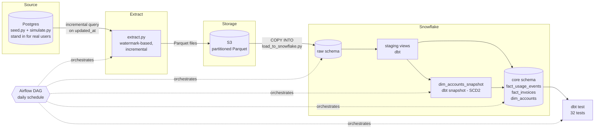

# SubscriptionPulse

A data pipeline for a fake SaaS company. Postgres to S3 to Snowflake to dbt to Airflow, fully automated and tested.

**Live:** [pipeline health & dbt docs](https://kumkumsareen1006.github.io/subscriptionpulse/)

---

## Why this project

Most portfolio pipelines follow the same shape: pull from a public API, load it into a warehouse, put a dashboard on top. That proves you can connect four tools. It doesn't prove you can make real engineering decisions.

This project is built around four decisions instead:

- Incremental, idempotent ingestion, not a full refresh
- A real dimensional model, including a Type 2 slowly changing dimension
- Data quality tests that actually stop the pipeline when they fail
- A pipeline that's been deployed and run unattended, not just on my laptop

All the data is synthetic. It models a project-management SaaS tool, similar to Asana or Trello: workspaces on different plans, usage events, invoices, and plan changes over time.

---

## Architecture



Airflow runs five tasks every day, in order: `extract` → `load_to_snowflake` → `dbt_snapshot` → `dbt_run` → `dbt_test`. Every task retries on failure except `dbt_test` - a failing test is a data problem, not a flaky-connection problem, so retrying it just delays the alert.

---

## Why incremental

Every source table has an `updated_at` column. `extract.py` keeps a watermark - the timestamp of the last successful extract - and only pulls rows newer than that. After each run, the watermark moves to the newest row it actually saw, not to the current time. Using the current time instead would risk skipping a row that gets written a second later but is still timestamped slightly earlier.

Tested by running `extract.py` twice back to back with no new data. The second run pulled nothing, which is the correct result.

---

## Why a Type 2 dimension

`accounts.plan_tier` only shows today's plan. If an account was on `starter` in March and upgraded to `pro` in June, joining usage events straight to `accounts` would relabel every March event as `pro` - the account's plan right now, not what it actually was in March.

`dim_accounts` fixes this with a dbt snapshot on `accounts`, using the `timestamp` strategy keyed on `updated_at`. Every time a row changes, the old version is closed out (`valid_to` is set) and a new one is added. Nothing gets overwritten.

Proven on real data - account 4 went `enterprise` → `starter` → `starter` and the history came out clean:

| account_id | plan_tier | valid_from | valid_to | is_current |
|---|---|---|---|---|
| 4 | enterprise | 2026-09-28 20:16:56.155 | 2026-09-28 20:52:44.116 | FALSE |
| 4 | starter | 2026-09-28 20:52:44.116 | 2026-09-28 20:55:39.456 | FALSE |
| 4 | starter | 2026-09-28 20:55:39.456 | *(null)* | TRUE |

That middle row exists because of an update that reset `plan_tier` to the same value it already had. The `timestamp` strategy versions on any change to `updated_at`, not specifically on `plan_tier` changing. A `check` strategy scoped to `plan_tier`/`status` would avoid that, at the cost of having to list every column that should count as a real change.

---

## Stack

| Layer | Tool |
|---|---|
| Source DB | Postgres (Docker) |
| Storage | S3, partitioned Parquet |
| Warehouse | Snowflake |
| Transform | dbt - staging views, fact tables, SCD2 snapshot, 32 tests |
| Orchestration | Airflow 3.3.1, CeleryExecutor, Docker |
| Docs hosting | GitHub Pages |

---

## Numbers

Pulled live from the [health page](https://kumkumsareen1006.github.io/subscriptionpulse/), not estimated:

- 21,300 rows across the raw layer (204 accounts, 19,238 usage events, 1,530 invoices, 328 subscription changes)
- 32 / 32 dbt tests passing
- 67 simulated days of activity
- 7 dbt models (4 staging, 2 facts, 1 SCD2 dimension) + 1 snapshot
- 5-task Airflow DAG, run end to end on a real EC2 box with my laptop closed (~3m18s)

Two real bugs came up while building this and got fixed, not hidden: a Snowflake/Parquet timestamp mismatch that silently corrupted every `updated_at` and `event_time` since Day 5, and a `COPY INTO` default-handling gap that left `_loaded_at` null on every row.

---

## Running it

Needs: Docker Desktop, Python 3.12, an AWS account with an S3 bucket, a Snowflake account.

```bash
git clone https://github.com/kumkumsareen1006/subscriptionpulse.git
cd subscriptionpulse
pip install -r requirements.txt
```

**1. Source data**
```bash
docker compose up -d
python seed.py
python simulate.py 60 7
```

**2. AWS + Snowflake** - run `snowflake_setup.sql`. It sets up the warehouse, database, a storage integration to your S3 bucket (no AWS keys stored in Snowflake), the stage, and the four raw tables.

**3. Credentials** - add a `.env` file with your AWS and Snowflake keys (see `extract.py` and `load_to_snowflake.py` for the variable names). Don't commit it.

**4. Run it once by hand**
```bash
python extract.py
python load_to_snowflake.py
cd subscriptionpulse_dbt
dbt snapshot --profiles-dir .
dbt run --profiles-dir .
dbt test --profiles-dir .
```

**5. Orchestrate with Airflow**
```bash
cd ../airflow
docker compose up airflow-init
docker compose up -d
```
Go to `localhost:8080` (`airflow` / `airflow`), unpause `subscriptionpulse_pipeline`, and trigger it.

**6. Docs + health page**
```bash
cd ../subscriptionpulse_dbt && dbt docs generate --profiles-dir .
cd .. && python generate_health_page.py
```

---

## Structure

```
subscriptionpulse/
├── schema.sql                  # source database DDL
├── seed.py                     # initial fake company
├── simulate.py                 # ongoing fake activity
├── extract.py                  # Postgres -> S3, incremental
├── load_to_snowflake.py        # S3 -> Snowflake raw
├── generate_health_page.py     # live pipeline-health page
├── snowflake_setup.sql         # one-time Snowflake/AWS setup
├── subscriptionpulse_dbt/      # dbt project: staging, core, snapshots, tests
├── airflow/                    # Airflow Docker setup + DAG
└── docs/                       # GitHub Pages: health page + dbt docs
```

---

## Limitations

- Airflow runs on one node. CeleryExecutor is there because Airflow 3.x's architecture expects it, not for actual distributed scale.
- The Slack alert is wired up but hasn't fired on a real failure yet. Only `dbt_test`'s no-retry failure path has actually been tested.
- Deployment was proven on a temporary EC2 box, since terminated. Nothing is running continuously right now - the warehouse, docs, and code are what's meant to last.
